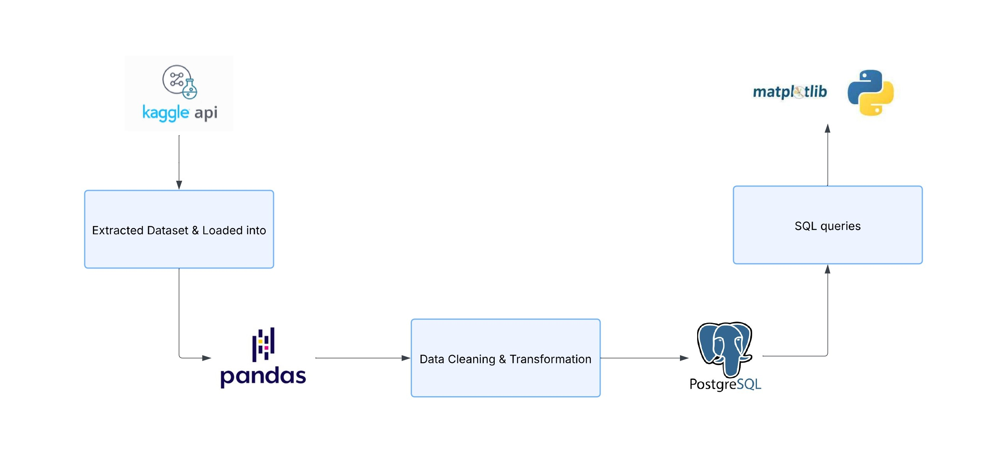

# 🛒 Retail Store Sales Analysis (SQL + Python + PostgreSQL)

This project demonstrates a complete data workflow — from data extraction and transformation to loading it into a PostgreSQL database and performing business analysis using SQL and Python. It follows a simplified ETL (Extract, Transform, Load) process, similar to those used in real-world data workflows.

---

## 📦 Dataset

- **Source**: [Kaggle - Retail Orders Dataset](https://www.kaggle.com/datasets/ankitbansal06/retail-orders)
- **Data Size**: 9,994 records
- **Columns**: Order ID, Order Date, Product ID, Region, Category, Sub-Category, Segment, Cost Price, Discount, Profit, etc.

---

## 🧰 Tools & Technologies Used

- **Python** (Pandas, Matplotlib)
- **SQL** (PostgreSQL)
- **SQLAlchemy** (for DB connection)
- **Kaggle API** (for dataset download)
- **Jupyter Notebook**

---

## 📌 Folder Structure
<pre>Retail-Store-Analysis/

├── retail_analysis.ipynb     # Main Jupyter Notebook  
├── orders.csv               # Raw dataset (extracted)  
├── orders_cleaned.csv       # Cleaned dataset after transformation  
├── retail-orders.zip        # Downloaded zip from Kaggle  
├── queries.sql              # SQL queries for BI tool integration  
├── README.md                # Project overview and insights  </pre>

---

## 🧭 Project Workflow Diagram

## ⚙️ Project Workflow

1. **Download** dataset from Kaggle using the API
2. **Extract** and read the file into a Pandas DataFrame
3. **Clean & transform** the data
    - Renamed columns
    - Handled missing values
    - Added new columns like `discount`, `sale_price`, and `profit`
4. **Push data** to a PostgreSQL database using SQLAlchemy
5. **Write SQL queries** to answer business questions
6. **Visualize** results using Python plots (Matplotlib)

---

## ❓ Business Questions Answered

1. What is the total sales and profit over time (monthly/yearly)?
2. Which regions are generating the highest profit and sales?
3. Most profitable categories and sub-categories?
4. Which ship modes are most used and profitable?
5. Top-performing cities/states by sales and profit
6. Impact of discount on profit
7. Category-wise Sales and Profit Overview
8. Which customer segments bring the most sales and profit?
9. Does Profit Margin Vary Across Sub-Categories?

---

## 📊 Key Insights

- Sales and profit vary month to month. Some months perform better than others.
- Western and Eastern regions have higher sales and profit.
- Copiers, Phones, and Accessories are among the most profitable sub-categories.
- Standard Class is the most used ship mode, but others also contribute well to profits.
- States like California lead in total sales.
- Higher discounts generally reduce profit, can even lead to losses.
- Technology is the most profitable and high-selling category overall.
- Consumers contribute the most to sales, but all segments bring value.
- Sub-categories like Copiers have better profit margins compared to pthers.

---

## 🧠 SQL Techniques Used

This project goes beyond basic querying and applies a variety of SQL techniques to extract meaningful insights from the data. Below are some of the key concepts used:

- **Aggregations & Grouping**: Used `SUM()`, `AVG()`, `COUNT()` with `GROUP BY` to calculate sales, profit, and orders.
- **Filtering & Sorting**: Applied `WHERE`, `CASE`, and `ORDER BY` to categorize data (e.g., by discount ranges or top performers).
- **Common Table Expressions (CTEs)**: Used `WITH` clauses to break complex queries into readable steps (e.g., monthly growth, top selling products per region).
- **Window Functions**: Applied `ROW_NUMBER() OVER(PARTITION BY ...)` to rank products by sales within each region or category.
- **Date Functions**: Used `EXTRACT()`, `TO_CHAR()` to analyze trends by month and year.
- **Profit Margin Calculation**: Computed custom metrics like profit margins using arithmetic in `SELECT` statements.

📄 The full set of queries can be found in the `queries.sql` file.

---

## 🚀 How to Run This Project

1. Clone the repository
2. Install dependencies: `pip install pandas sqlalchemy psycopg2-binary matplotlib`
3. Set up PostgreSQL and create a database named `retail_store`
4. Run the notebook `retail_analysis.ipynb` step by step